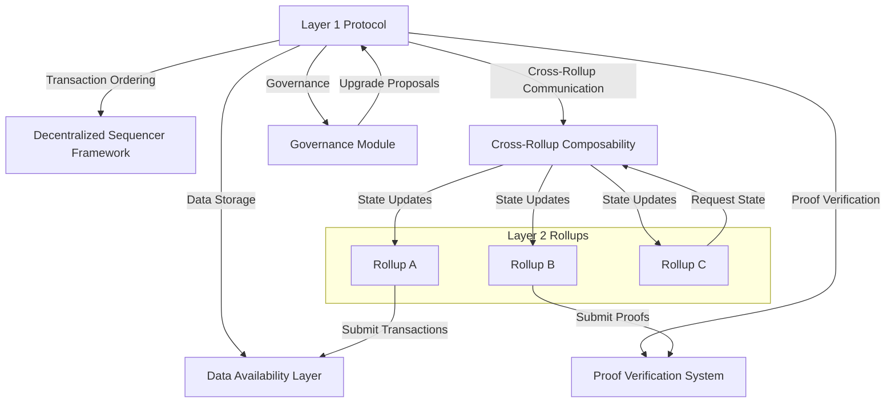

### Enshrined Functionality Framework for a Custom Layer 1 Protocol

#### **1. Vision and Goals**

The objective of this custom enshrined functionality framework is to embed native Layer 2 (L2) support into a Layer 1 (L1) blockchain protocol, enabling scalability, security, and interoperability. By designing the framework with modularity and flexibility, we aim to standardize rollup operations, optimize performance, and reduce costs for developers and users.

##### **Real-World Applications**

1. **Decentralized Finance (DeFi)**: Enable high-throughput, low-cost transactions for platforms like decentralized exchanges, lending protocols, and automated market makers.
2. **Gaming and NFTs**: Support seamless, low-latency interactions in blockchain-based gaming, including in-game assets and non-fungible token (NFT) marketplaces.
3. **Cross-Border Payments**: Facilitate scalable, trustless, and affordable international payment systems with fast settlement times.
4. **Supply Chain Management**: Provide transparency and efficiency for tracking goods, ensuring real-time updates and cost-efficient operations across global supply chains.
5. **Identity and Credential Verification**: Create interoperable, secure systems for managing digital identities and credentials without exposing private information.

##### **Key Goals**

1. **Native Scalability**: Optimize data availability, transaction processing, and proof verification.
2. **Enhanced Security**: Ensure rollups inherit robust security guarantees from the L1.
3. **Interoperability**: Facilitate seamless communication between L1 and L2, and across multiple L2s.
4. **Cost Efficiency**: Minimize operational expenses, especially for data storage and execution.
5. **Developer Accessibility**: Provide standardized APIs, tooling, and resources for simplified development.

---

#### **2. High-Level Architecture**



##### **A. Core Components**

1. **Data Availability Layer**: Provides scalable storage and ensures data availability using sampling-based mechanisms.
2. **Proof Verification System**: Verifies zk-SNARK, zk-STARK, and fraud proofs for rollup state transitions.
3. **Decentralized Sequencer Framework**: Enables fair and decentralized transaction ordering.
4. **Cross-Rollup Composability**: Facilitates trustless interactions between rollups and L1.
5. **Governance Module**: Supports decentralized decision-making for protocol upgrades.

---

#### **6. Project Structure**

```
root/
├── cmd/                     # Entry points for applications (e.g., CLI, server)
│   ├── server/
│   │   └── main.go          # Main entry point for the Layer 1 node
│   ├── sequencer/
│   │   └── main.go          # Entry point for the shared sequencer module
│   └── verifier/
│       └── main.go          # Entry point for proof verification components
├── internal/                # Core internal libraries and modules
│   ├── data_availability/   # Implements data blob storage and sampling logic
│   │   ├── availability.go
│   │   └── sampling.go
│   ├── proofs/              # Proof verification logic (e.g., zk-SNARKs, zk-STARKs)
│   │   ├── snark.go
│   │   └── stark.go
│   ├── governance/          # Governance and upgrade mechanisms
│   │   ├── voting.go
│   │   └── proposal.go
│   ├── rollup_registry/     # Manages rollup state trees and interactions
│   │   ├── registry.go
│   │   └── state_tree.go
│   ├── messaging/           # Synchronous messaging and cross-rollup communication
│   │   ├── message_router.go
│   │   └── sync.go
│   └── utils/               # Utility functions and shared logic
│       ├── logger.go
│       ├── metrics.go
│       └── crypto.go
├── pkg/                     # Public reusable packages
│   ├── api/                 # API definitions and handlers
│   │   ├── data_api.go
│   │   ├── proof_api.go
│   │   └── sequencer_api.go
│   ├── client/              # SDKs or client libraries for interacting with the protocol
│   │   ├── data_client.go
│   │   └── proof_client.go
│   └── contracts/           # Smart contract ABIs and deployment scripts
│       ├── sequencer_registry.sol
│       ├── state_tree.sol
│       └── governance.sol
├── scripts/                 # Deployment, testing, and automation scripts
│   ├── deploy.sh
│   ├── test.sh
│   └── migrate.sh
├── test/                    # Integration and end-to-end tests
│   ├── data_availability_test.go
│   ├── proofs_test.go
│   └── messaging_test.go
├── config/                  # Configuration files
│   ├── config.yaml
│   └── secrets.yaml
├── docs/                    # Documentation for developers and users
│   ├── api_reference.md
│   ├── architecture.md
│   └── setup_guide.md
├── Dockerfile               # Docker configuration for containerized deployment
├── docker-compose.yml       # Docker Compose setup for local development
├── Makefile                 # Build and management commands
└── README.md                # Overview of the project
```

This document outlines the comprehensive design for a scalable rollup framework integrated into a Layer 1 blockchain protocol.
